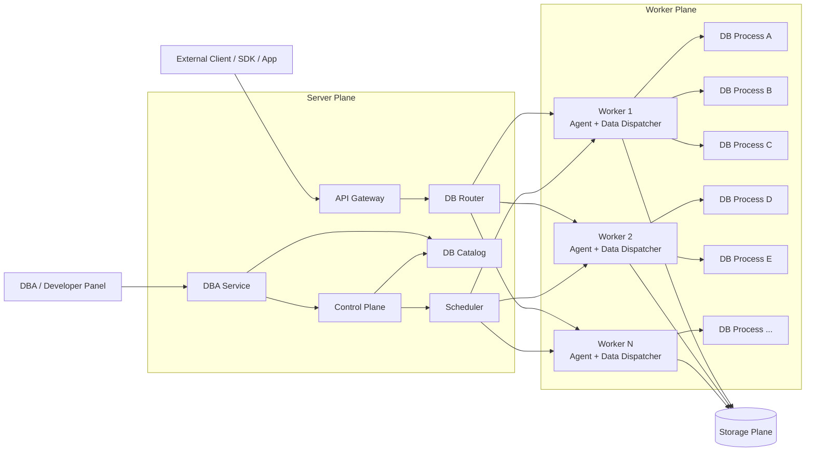

# TursoDB DB Platform — Detailed Architecture Design (FINAL)

> 目标：基于自建 TursoDB Engine 构建独立 DB Platform。平台自己负责 Server、Worker、调度、路由、DBA、生命周期、可靠性与存储管理，不依赖 Turso Cloud 控制面。
>
> 核心模型：**Server 负责流量入口、路由与管理；Worker 是数据库运行宿主；一个 DB 对应一个独立进程；一个 Worker 同时运行多个 DB 进程，并尽可能提高单 Worker 的承载密度。**

> 文档状态：**FINAL / Development Contract**。以下核心决策已冻结：Local NVMe + Synchronous Remote WAL + Async Snapshot；Stateless-by-default + Explicit Session；Cold Start 对调用方透明；Resource Budget Packing；Server→Worker 使用 gRPC/HTTP2 Streaming；Worker→DB Process 使用 Unix Domain Socket；Catalog/Control Plane 以 PostgreSQL 为权威事实源；Panel/Control Plane 系统数据统一使用 PostgreSQL；外部统一 HTTP/JSON/NDJSON；部署使用 Dockerfile + Docker Compose。

---

## 1. 设计原则

### 1.1 Server 与 Worker 明确分工

- **Server**：API、DB Router、Catalog、Scheduler、DBA Panel、权限与平台控制。
- **Worker**：运行 DB Process、执行 SQL、管理本机 DB 生命周期和资源。
- Server 不直接运行 TursoDB。
- Worker 不负责全局调度与平台元数据决策。

### 1.2 一个 DB = 一个进程

```text
Worker
├── DB Process A -> db_a
├── DB Process B -> db_b
├── DB Process C -> db_c
└── DB Process ...
```

进程是 DB 的资源、故障和生命周期隔离边界。

### 1.3 Worker 数量远小于 DB 数量

```text
DB Count >> Active DB Count >> Worker Count
```

平台通过 DB 冷热生命周期、进程按需启动和高密度 Worker 承载实现 Serverless，而不是“一 DB 一 Worker”。

### 1.4 Control Plane 不进入 SQL 热路径

热库查询应保持：

```text
Client -> Server Router -> Worker Dispatcher -> DB Process
```

Catalog、Scheduler、DBA 等只参与状态变化，不参与每一条 SQL。

### 1.5 DB 不永久绑定 Worker

DB 的 Owner 可以变化。Scheduler 决定 DB 当前在哪个 Worker 上运行，Worker 故障、Drain 或资源调整时允许重新 Placement。

---

## 2. 总体架构



---

## 3. Logical Tree

```text
DB Platform
│
├── Server Plane
│   ├── API Gateway
│   ├── DB Router
│   ├── Control Plane
│   ├── DB Catalog
│   ├── Scheduler
│   └── DBA Panel / DBA Service
│
├── Worker Plane
│   ├── Worker Agent              # Control Path
│   ├── Worker Data Dispatcher    # Data Path
│   ├── DB Process A -> TursoDB
│   ├── DB Process B -> TursoDB
│   ├── DB Process C -> TursoDB
│   └── Local Resource Manager
│
└── Storage Plane
    ├── DB Persistent Data
    ├── WAL / Recovery Data
    ├── Snapshot
    └── Backup Repository
```

---

# 4. Server Plane

Server 是平台入口和全局控制中心，但不是 DB Runtime。

## 4.1 API Gateway

统一处理：

- Authentication / Authorization
- Tenant / DB Context
- Rate Limit / Quota
- SQL / Query API
- Management API

外部接口的具体协议可以独立演进，不影响 Worker 内部模型。

---

## 4.2 DB Router

Server 只维护到 **Worker 粒度** 的路由：

```text
db_id -> worker_id -> worker_endpoint
```

不建议 Server 维护：

```text
db_id -> PID / process port
```

进程属于 Worker 本地状态，应该由 Worker 自己管理。

### Hot Path

```text
Client
  │
  ▼
Server Router
  │  route cache: db_123 -> worker_07
  ▼
Worker 07 Data Dispatcher
  │  local map: db_123 -> PID / Unix Socket
  ▼
DB Process
  │
  ▼
TursoDB
```

Router Cache 应允许短时间脱离 Catalog 独立工作。Control Plane 短暂不可用时，已运行 DB 的正常 SQL 不应因此中断。

---

## 4.3 Control Plane / Catalog

Catalog 是 DB 状态的全局事实来源，至少维护：

```text
DB ID
Tenant / Owner
Lifecycle State
Worker Owner
Owner Epoch
Storage Location
Resource Policy
DB Version
Create Time
```

Control Plane 负责 DB Create / Delete / Start / Stop / Move 等状态变更。

---

## 4.4 Scheduler

Scheduler 负责 DB Placement，而不是查询调度。

输入主要包括：

```text
Worker CPU
Worker Memory
Worker Disk / IOPS
Worker Process Count
Worker State
DB Resource Profile
DB Priority
Region / AZ
Affinity / Anti-affinity
```

输出：

```text
db_123 -> worker_17
```

Scheduler 的结果最终转换为 Worker Agent 的 Start / Stop / Move 指令。

---

## 4.5 DBA Panel / DBA Service

DBA Panel 属于 Server Plane，主要提供：

```text
Database
├── List / Detail
├── Create / Delete
├── Start / Stop / Restart
└── Move Worker

SQL
├── SQL Console
├── Active Query
└── Slow Query

Worker
├── Worker List
├── Resource Usage
├── Running DB
└── Drain Worker

Reliability
├── Backup
├── Restore
├── Snapshot
└── Failover

Security
├── User / Role
├── Token
└── Audit Log
```

DBA 操作走 Control Path，不和 SQL Data Path 混在一起。

---

# 5. Worker Plane

Worker 是平台最核心的数据运行节点，应尽量少，但单机高密度承载 DB Process。

```text
Worker
│
├── Worker Agent
│     └── 管理命令 / Heartbeat / Resource Report
│
├── Worker Data Dispatcher
│     └── db_id -> local DB process
│
├── DB Process 001 -> TursoDB
├── DB Process 002 -> TursoDB
├── DB Process 003 -> TursoDB
└── ...
```

---

## 5.1 Worker Agent — Control Path

长期驻留，负责：

```text
Heartbeat
Resource Report
Start DB
Stop DB
Restart DB
Kill DB
Drain Worker
Process Monitoring
Storage Preparation
Ownership Validation
```

Agent 不应该成为 SQL 转发瓶颈。

---

## 5.2 Worker Data Dispatcher — Data Path

这是 Worker 的稳定数据入口。

```text
Server
   │
   ▼
Worker Data Dispatcher
   │
   ├── db_a -> DB Process A
   ├── db_b -> DB Process B
   └── db_c -> DB Process C
```

DB Process 与 Dispatcher **固定使用 Unix Domain Socket** 通信，不允许每个 DB Process 暴露独立对外网络端口。Server 到 Worker 的 Data Protocol 固定采用 **gRPC / HTTP2 Streaming**。

这样有几个架构收益：

- Worker 对 Server 只有稳定 endpoint。
- DB Process PID / Socket 变化不影响 Server Router。
- 大量 DB Process 不消耗大量对外监听端口。
- Worker 可以统一做请求取消、超时、流量统计和进程健康判断。

Worker 本地维护：

```text
db_id -> state -> pid -> local_socket -> owner_epoch
```

### Server → Worker Data Protocol Contract

固定能力：

```text
Execute
ExecuteBatch
StreamRows
Cancel
Deadline
Backpressure
OpenSession / CloseSession
Begin / Commit / Rollback
db_id
owner_epoch
session_id
transaction_id
structured_error_code
```

大结果集必须 Streaming；Server 不得无上限缓存完整结果集。`Cancel` 与 `Deadline` 必须向下传播到对应 DB Process。

---

## 5.3 DB Process

每个 DB 对应独立进程：

```text
PID 1001 -> db_a
PID 1002 -> db_b
PID 1003 -> db_c
```

进程边界提供：

- Crash Isolation
- Memory Isolation
- CPU Accounting
- 单 DB Restart / Kill
- 独立版本与状态管理
- DB 粒度资源限制

DB Process 不感知全局 Scheduler，只接受当前 Worker 的生命周期与数据请求。

---

# 6. Data Path 与 Control Path

必须逻辑隔离。

```text
                    Server
                /            \
               /              \
        Data Path           Control Path
            │                   │
            ▼                   ▼
       DB Router            Scheduler
            │                   │
            ▼                   ▼
 Worker Dispatcher        Worker Agent
            │                   │
            ▼                   ├── Start
        DB Process              ├── Stop
                                ├── Restart
                                └── Drain
```

Data Path 的抖动不能由 DBA 操作、Catalog 扫描或 Scheduler 重计算引起。

---

# 7. DB Serverless Lifecycle

```text
COLD
 │ request / prewarm
 ▼
STARTING
 │ process ready
 ▼
WARM
 │ sustained traffic
 ▼
HOT
 │ traffic drops
 ▼
WARM
 │ idle / eviction
 ▼
COLD
```

### COLD

```text
DB Process = 0
CPU        = 0
Memory     = 0
Data       = Persistent
```

### STARTING

Worker 完成：

```text
Ownership Check
Storage Prepare
Start Process
Open DB
Health Ready
Register Local Route
```

### WARM

进程存在，可立即处理请求。

### HOT

持续活跃，获得更高保留优先级，尽量避免被回收。

Serverless 本质是 **DB Process 按需存在，Worker 长期存在**。

---

# 8. Cold Start Request Path

Cold Start 对调用方**透明**。Query API 不返回 `DB_WAKING` 让客户端自行重试；Server 在请求 Deadline 内等待 DB READY，然后继续执行原请求。

```text
Client
  │
  ▼
Server Router
  │
  ├── RUNNING ───────────────> Worker Dispatcher -> DB
  │
  └── COLD
       │
       ▼
    Coalesce Wakeup
       │
       ▼
    Scheduler / Placement
       │
       ▼
    Worker Agent
       │
       ├── Acquire Ownership + Epoch
       ├── Prepare Local NVMe Working Set
       ├── Restore Snapshot if needed
       ├── Replay Remote WAL
       ├── Start DB Process
       └── READY
             │
             ├── Update Route
             └── Release waiting requests
```

同一个 COLD DB 同时收到多个请求时，只允许一个 Wakeup/Start 动作，其余请求等待同一个 READY 结果。若启动超过调用方 Deadline，则返回明确的 timeout / unavailable 错误，不泄漏内部 `WAKING` 状态。

---

# 9. Worker Capacity 与高密度 DB Process

这是需要重点设计的部分。

Worker 不能简单用“最大 DB 数量”决定是否还能承载新 DB，因为不同 DB 的资源差异可能很大。

建议 Worker 使用资源预算模型：

```text
Worker Capacity
│
├── CPU Budget
├── Memory Budget
├── FD Budget
├── Local Disk Budget
├── IOPS Budget
└── Process Budget
```

Scheduler 采用 **Resource Budget Packing**，目标是在满足 SLO 的前提下尽可能减少 Worker 数量。

固定水位：

```text
Target Packing        70% ~ 75%
Stop New Placement    80%
Emergency Protection  90%
```

集群必须保留 Failover Capacity：

```text
reserve >= max(1 whole Worker, 20% total effective capacity)
```

DB Count 只作为 hard safety limit，不作为主要 Placement 指标。

DB 启动前做 Admission Check：

```text
CanStart(db_x, worker_y)
    = CPU OK
    & Memory OK
    & FD OK
    & Disk OK
    & Process Count OK
```

Worker 资源压力过高时，优先处理低价值的 WARM DB：

```text
HOT     -> 尽量保留
WARM    -> 可 Evict
COLD    -> 不占进程资源
```

不建议让 Worker 数量随 DB 数量线性增长。Worker 扩容应该主要由 **真实活跃工作集和资源压力** 触发。

---

# 10. DB Ownership / Lease / Fencing

一个 DB 同一时刻只能有一个有效 Worker Owner。

Catalog 示例：

```text
DB ID : db_123
State : RUNNING
Owner : worker_17
Epoch : 834
```

所有 Start / Write / Ownership 相关动作都携带 Epoch。

Worker 故障后：

```text
worker_17 lost
     │
     ▼
Invalidate Lease
     │
Epoch 834 -> 835
     │
     ▼
Scheduler selects worker_23
     │
     ▼
worker_23 starts db_123 with epoch 835
```

旧 Worker 即使短暂恢复，也不能继续以 epoch 834 对该 DB 提供有效写入。

这是避免 Split Brain 的基础机制。

---

# 11. Storage Plane

Storage Contract 已冻结为：

```text
Local NVMe
    = Serving / Working Set / Performance

Synchronous Remote WAL
    = Commit Durability / Failover RPO

Object Storage Snapshot
    = Base Image / Backup / Cold Restore
```

架构：

```text
                    WRITE
                      │
                      ▼
                 DB Process
                  (TursoDB)
                      │
              Local WAL / DB File
                      │
                      ▼
              Remote WAL Durable
                      │
                 ACK COMMIT
                      │
                      └──────────────┐
                                     ▼
                              Async Snapshot
                                     │
                                     ▼
                               Object Storage
```

## 11.1 Commit Durability Contract

**事务只有在 Remote WAL 已持久化后才允许向 Client 返回 Commit Success。**

```text
COMMIT
  -> Local WAL append
  -> Remote WAL durable
  -> ACK Client
```

因此正常 Worker Crash / Failover 的目标语义是：

```text
RPO = 0 committed transaction
```

本地 NVMe 丢失不能造成已经成功返回的 committed transaction 丢失。

## 11.2 DB Mobility / Failover

Worker A 到 Worker B 的恢复路径：

```text
Object Snapshot
      +
Remote WAL after snapshot
      │
      ▼
Worker B Local NVMe
      │
      ├── restore base
      ├── replay WAL
      └── open DB with new epoch
```

Planned Move 可以在目标 Worker 预拉取 Snapshot / Working Set，再完成 Ownership Cutover；Unplanned Failover 则从最近 Snapshot + Remote WAL 恢复。

## 11.3 Ownership / Storage Fencing

Remote WAL 写入必须携带 `db_id + owner_epoch`。Storage Durability Layer 必须拒绝旧 Epoch 的 append，从而把 Split Brain 防线放到持久化层，而不只依赖 Control Plane。

## 11.4 Snapshot

Snapshot 异步进行，不进入 Commit Hot Path。Snapshot 生成后记录：

```text
db_id
snapshot_id
base_lsn
checksum
created_at
```

恢复时从 Snapshot 的 `base_lsn` 继续 replay Remote WAL。

---

# 12. Failure Handling

## 12.1 DB Process Crash

```text
DB Process Crash
      │
      ▼
Worker Agent Detect
      │
      ├── Mark unhealthy
      ├── Clear local route
      └── Restart / report failure
```

只影响对应 DB，不应拖垮同 Worker 上其他 DB。

## 12.2 Worker Failure

```text
Worker Heartbeat Lost
      │
      ▼
Mark Worker Unavailable
      │
      ▼
Invalidate DB Ownership
      │
      ▼
Re-placement
      │
      ▼
Start DB on healthy Worker
      │
      ▼
Update Route
```

## 12.3 Worker Drain

```text
ACTIVE
  │
  ▼
DRAINING
  ├── no new DB placement
  ├── stop / move cold & warm DB
  └── migrate remaining DB
  │
  ▼
EMPTY
```

---

# 13. Session / Transaction Routing

平台采用：**Stateless by Default + Explicit Stateful Session**。

## 13.1 Stateless Execute

普通请求：

```text
execute(db_id, sql)
```

请求不携带 Session 时，Server 只需要根据 `db_id` 路由到当前 Owner Worker。单个请求内可以执行原子 transaction，但请求结束后不保留 connection context。

## 13.2 Explicit Session

需要 Interactive Transaction 时显式创建 Session：

```text
OpenSession(db_id)
   -> session_id
   -> pin worker_id
   -> pin db_process
   -> pin underlying connection / tx context
```

随后：

```text
BEGIN
SQL
SQL
COMMIT / ROLLBACK
```

固定默认值：

```text
Session idle timeout       = 60 s
Transaction max lifetime   = 30 s
```

## 13.3 Failover Semantics

Worker / DB Process Failover 后：

- 已经 Remote-WAL durable 且返回成功的 Commit 必须保留。
- 未完成 Interactive Transaction **不做透明恢复**。
- 受影响 Session 返回明确 `TRANSACTION_LOST` / `SESSION_LOST`。
- Client 可以重新 OpenSession 并重试业务事务。

这种设计避免平台假装恢复一个已经失去原 connection context 的事务。

---

# 14. Observability / Security

保持平台级统一能力：

```text
Observability
├── Request Latency
├── Query Latency
├── DB Process CPU / Memory
├── Worker Saturation
├── Cold Start
├── Process Crash
└── Slow Query

Security
├── Tenant Isolation
├── DB Auth
├── RBAC
├── Token / Credential
├── Audit Log
└── DBA Operation Audit
```

这些能力由 Server 汇总，Worker 只负责产生运行时数据。

---

# 15. 已冻结的核心架构决策

以下内容属于 **Development Contract**，实现不得自行改变其系统语义。

## 15.1 Storage / Durability

```text
Local NVMe
+ Synchronous Remote WAL
+ Async Object Storage Snapshot
```

Commit Success 必须发生在 Remote WAL durable 之后。正常 Failover 要求 `RPO = 0 committed transaction`。

## 15.2 Ownership

```text
Single DB Process Owner
+ Lease
+ Monotonic Owner Epoch
+ Storage-level Fencing
```

同一个 DB 同时只允许一个有效写 Owner。

## 15.3 Transaction

```text
Stateless by Default
+ Explicit Stateful Session
```

Session Idle Timeout = 60s；Transaction Max Lifetime = 30s；Failover 中未提交事务返回 `TRANSACTION_LOST`。

## 15.4 Cold Start

Query API 使用 **Transparent Wake**：首个请求在 Deadline 内等待 DB Ready，不向应用暴露 `DB_WAKING` 重试协议。

## 15.5 Scheduling

```text
Resource Budget Packing
Target      = 70% ~ 75%
Stop Admit  = 80%
Emergency   = 90%
Failover Reserve >= max(1 Worker, 20% effective capacity)
```

CPU / Memory / IOPS / FD / Disk / Process Pressure 为 Placement 主指标，DB Count 仅作为 safety limit。

## 15.6 Internal Protocol

```text
Server -> Worker : gRPC / HTTP2 Streaming
Worker -> DB     : Unix Domain Socket
```

协议必须支持 Streaming、Cancel、Deadline、Backpressure、Session、Transaction、Epoch 与 Structured Error。

---

# 16. 工程验收指标

> 本章节中的数值是**设计验收基线（Target）**，不是当前实测结果。定稿后工程实现必须用压测、故障注入和一致性测试证明达到这些阈值；未达到即视为架构实现不满足设计。

## 16.1 统一验收环境

为了让指标可比较，性能类验收默认使用以下基线环境；实际生产机器更高配时仍不能放宽指标。

```text
Network
- Server 与 Worker：同 Region / 同 AZ 优先
- Server <-> Worker RTT：<= 1 ms
- Worker <-> Remote WAL RTT：P95 <= 2 ms
- Network：>= 10 Gbps

Server Baseline
- 8 vCPU
- 16 GiB Memory

Worker Baseline
- 32 vCPU
- 128 GiB Memory
- Local NVMe SSD

Hot Read Dataset
- DB Size：1 GiB
- Indexed point lookup
- Result <= 1 KiB
- Data 已进入 OS / DB page cache

Error Rate
- 不统计非法 SQL、权限拒绝、客户端主动取消等预期错误
```

如未来运行环境明显不同，应调整**测试环境**而不是静默修改验收阈值。

---

## 场景：热 DB 查询

- `Server Router + Worker Dispatcher` 平台附加延迟：P95 **<= 3 ms**，P99 **<= 8 ms**。
- Indexed Point Read 端到端延迟：P95 **<= 10 ms**，P99 **<= 25 ms**。
- 单 Server（8 vCPU）持续处理能力：**>= 10,000 request/s**，同时满足上述平台延迟指标。
- Router Cache Hit Rate：稳定流量下 **>= 99.9%**。
- 平台自身 5xx / routing error：**< 0.01%**。

## 场景：冷 DB 首次访问

这里指 DB 数据已经可被 Worker 访问，不包含大规模远程数据复制时间。

- `COLD -> READY`：P50 **<= 150 ms**，P95 **<= 500 ms**，P99 **<= 1 s**。
- Cold First Query：P95 **<= 700 ms**，P99 **<= 1.5 s**。
- Start Success Rate：**>= 99.9%**。
- 同一个 COLD DB 同时进入 **100 个请求**时，只允许产生 **1 个 DB Process Start**。
- 等待中的请求不得出现重复启动导致的数据损坏或双 Owner，目标 **0 次**。

## 场景：Worker 高密度运行

基线 Worker：32 vCPU / 128 GiB。

- 单 Worker 至少稳定维持 **500 个 WARM DB Process**。
- Idle DB Process 增量 RSS：P95 **<= 24 MiB / DB**。
- 单 DB Idle CPU：长期平均 **<= 0.1% CPU core**。
- Worker 常态 Target Packing：**70% ~ 75%**。
- Stop New Placement Watermark：CPU / Memory / I/O 任一达到 **80%** 时停止普通 DB 新 Placement，并优先回收低优先级 WARM DB。
- Emergency Watermark：任一核心资源达到 **90%** 时必须进入保护模式，不允许继续无约束启动 DB。
- 集群 Failover Reserve：**>= max(1 个完整 Worker, 20% 总有效容量)**。
- Worker 不得因单 DB OOM 导致 Worker Agent / Dispatcher 退出，目标 **0 次**。

> 500 个 WARM Process 是容量验收基线，不是上限。Worker 数量是否足够少，最终通过活跃工作集和上述资源水位决定，而不是通过硬编码 DB 数决定。

- 在 N>=5 Worker 的集群中，Scheduler 必须保持 **>=20% effective failover capacity**；若 20% 小于 1 台完整 Worker，则至少保留 **1 台 Worker** 的可接管容量。
- 稳态 workload 下，活跃 Worker 的平均 Target Packing 应落在 **70%~75%** 区间，允许为 Failover Reserve 保留未使用容量。

## 场景：DB Process Crash

- 进程退出检测：**<= 500 ms**。
- Worker 本地失效 Route 清理：**<= 100 ms**。
- Storage Ready 前提下，自动 Restart：P95 **<= 1 s**。
- 单 DB Crash 期间，同 Worker 其他 DB 的请求错误率增加 **<= 0.1%**。
- 同 Worker 其他 DB P99 延迟恶化 **<= 10%**。
- Crash DB 不得造成其他 DB Process 被 Kill，目标 **0 次**。

## 场景：Worker 故障

- Worker Heartbeat：**1 s / 次**。
- 连续 **3 次** Heartbeat Miss 后进入 Suspect / Unavailable。
- Worker Failure Detection：P95 **<= 4 s**。
- Ownership Fencing + Re-placement + Route Recovery：P95 **<= 10 s**。
- DB 恢复可查询：RTO P95 **<= 15 s**。
- 基线 Durable Storage 模式下：RPO **= 0 committed transaction**。
- Split Brain 有效写入：**0 次**。
- 旧 Epoch Worker 的写请求必须 **100% 被拒绝**。

## 场景：Worker Drain / DB Move

- Worker 进入 DRAINING 后 **<= 1 s** 停止接受新的 DB Placement。
- 单个 WARM DB Planned Move 的不可服务窗口：P95 **<= 5 s**。
- 连续迁移 **100 个 WARM DB**：**<= 60 s** 完成。
- Planned Move Success Rate：**>= 99.9%**。
- Move 过程中用户可见平台错误率：**<= 0.1%**。
- Move 完成后旧 Worker 有效写入：**0 次**。

## 场景：Control Plane 故障

执行 **30 分钟** Control Plane 全不可用故障注入：

- 已经 RUNNING 的 DB Data Path 请求成功率：**>= 99.99%**。
- Data Path P99 延迟相对故障前恶化：**<= 10%**。
- 已缓存 Route 不得因 Control Plane 不可用主动过期导致全量中断。
- Control Plane 恢复后 Catalog / Worker State 收敛：**<= 30 s**。
- 故障期间禁止产生双 Owner，目标 **0 次**。

## 场景：路由失效 / Stale Route

- Worker 返回 `NOT_OWNER / EPOCH_MISMATCH` 后，Server Route Refresh：P95 **<= 500 ms**。
- 单请求最多允许 **1 次透明 Route Retry**，避免 retry storm。
- Stale Route 自动恢复成功率：**>= 99.9%**。
- 可恢复的 Stale Route 最终泄漏给 Client 的错误比例：**< 0.01%**。

## 场景：并发 DB 启动

单 Worker 进行高并发 Start：

- 持续 Start Throughput：**>= 50 DB Process/s**。
- `STARTING -> READY` P95：**<= 1 s**。
- Start Failure Rate：**< 0.1%**。
- 实际 Memory 使用不得超过 Admission 估算值 **10%** 以上。
- 任意时刻不得突破 Emergency Watermark 后继续无界 Start。

## 场景：Commit Durability / Remote WAL

- Commit Success 前 Remote WAL durable 确认率：**100%**。
- 已向 Client 返回成功的 committed transaction，在 Worker Power-off 故障注入后丢失：**0 笔**。
- 旧 `owner_epoch` Remote WAL append 接受率：**0%**。
- 正常基线环境下 Remote WAL append + durable：P95 **<= 5 ms**，P99 **<= 15 ms**。
- Remote WAL 暂时不可用时，不允许降级为“本地 commit 后假成功”；写请求必须失败或等待 Deadline，错误语义正确率 **100%**。
- 连续执行 **1,000,000 次 committed transaction** 并随机 Kill Worker，恢复后 committed transaction 完整率：**100%**。

## 场景：Backup / Restore

- Backup Job Success Rate：**>= 99.9%**。
- Restore Job Success Rate：**>= 99.9%**。
- 1 GiB DB Restore 到可查询状态：P95 **<= 60 s**。
- Restore 后 integrity / checksum 校验通过率：**100%**。
- Backup 恢复点目标：RPO **<= 5 min**。
- 若支持 PITR：请求恢复时间点与实际恢复点偏差 **<= 1 min**。

> Failover RPO 与 Backup RPO 是两个概念：正常 Worker Failover 要求 committed data RPO=0；备份用于灾难恢复，可接受独立的备份恢复点窗口。

## 场景：资源隔离 / Noisy Neighbor

- 单 DB 打满其 CPU Limit 时，其他正常 DB 的 P99 延迟恶化 **<= 20%**。
- 单 DB 触发 Memory Limit / OOM 时，其他 DB 请求成功率 **>= 99.99%**。
- 单 DB 制造持续高 I/O 时，其他正常 DB P99 延迟恶化 **<= 30%**。
- DB Process OOM / Crash 的故障半径必须保持在 **1 DB Process**。
- Worker Agent / Dispatcher 在上述压力测试中可用率：**100%**。

## 场景：Session / Transaction

- Session Pinning 正确率：**100%**。
- 一个 Session 在生命周期内不得跨 DB Process：**0 次**。
- Transaction Commit / Rollback 一致性测试：**100%** 通过。
- 默认 Session Idle Timeout：**60 s**。
- 默认单 Transaction 最大持续时间：**30 s**。
- Worker / DB Restart 后失效 Transaction 必须返回明确的 `TRANSACTION_LOST` 类错误，不允许假成功，错误语义正确率 **100%**。

## 场景：DBA 操作

- Create DB 元数据操作：P95 **<= 1 s**。
- Start DB：P95 **<= 1 s**（Storage Ready）。
- Stop DB：P95 **<= 2 s**。
- Restart DB：P95 **<= 2 s**。
- DBA 操作 API Success Rate：**>= 99.9%**。
- Audit Log 完整率：**100%**。
- DBA 批量操作期间 Data Path P99 延迟恶化：**<= 5%**。

## 场景：Public HTTP Contract

- Public Browser/SDK 接口中 gRPC 暴露数量：**0**；外部统一 HTTP。
- Hrana 客户端兼容端点（`/db/{db_id}/v2/pipeline`、`/v3/pipeline`、`/v3/cursor`）gRPC 暴露数量：**0**；仍为 HTTP + JSON/NDJSON，且不属于 OpenAPI 覆盖范围。
- OpenAPI 对 `/api/v1/*` 与非 streaming `/data/v1/*` public route 覆盖率：**100%**。
- 相同 `Idempotency-Key` 对 Create/Move/Backup/Restore 等副作用请求重复提交 100 次：实际创建的 Operation 数量 **= 1**。
- NDJSON streaming 在 Client 降速到 **1 MiB/s** 时，Server 单请求额外 buffered result memory：P95 **<= 8 MiB**。
- Client cancel/disconnect 后，对应 Server->Worker request 在 **1 s** 内收到 cancel 或完成清理：**>= 99.9%**。

## 场景：Panel / Control Plane PostgreSQL 持久化

- Panel 与 Control Plane 系统数据写入 PostgreSQL 的覆盖率：**100%**。
- `db-server` 重启 100 次后，Catalog / RBAC / Job / Audit Metadata 数据丢失：**0 条**。
- PostgreSQL 短暂不可用 **30 s** 时，已有 Hot/Warm DB 的 Data Path SQL 成功率：**>= 99.99%**；新的控制面写操作允许失败并返回明确错误。
- PostgreSQL 恢复后，Server Catalog Cache / Worker State 自动完成 reconcile：P95 **<= 30 s**。
- Panel 系统数据直接写入 Worker Plane / TursoDB 的请求数量：**0**。

## 场景：Docker Compose 部署

- 已完成 image build 的干净环境执行 `docker compose up -d` 后，核心服务全部进入 Healthy：**<= 120 s**。
- 任意重启 `web` 或 `db-server` 容器，Catalog 数据丢失：**0**。
- 任意重启单个 WAL replica，已成功 Commit 的 transaction 丢失：**0**。
- Worker container 重启后的数据库恢复仍满足本文 Worker Failover RTO/RPO 指标。
- 核心内部服务（PostgreSQL / Worker gRPC / WAL / MinIO）直接发布公网端口数量：生产 Compose 配置 **= 0**。

---

# 17. 技术选型（Frozen）

本章节冻结平台技术栈。开发 Agent 不得自行替换核心语言、RPC、Catalog、Remote WAL 共识方案或 TursoDB 集成边界；如发现选型无法满足本文工程验收指标，应回到架构评审。

## 17.1 总体选型

```text
Frontend
  TypeScript + Vite + React + Ant Design

Backend
  Rust (single backend language)
  Tokio async runtime

Server Plane
  Axum + Tower
  Tonic / gRPC + Protobuf
  PostgreSQL + SQLx (authoritative Catalog)

Worker Plane
  Rust Worker Agent / Dispatcher
  Linux cgroup v2 + pidfd
  Unix Domain Socket

DB Process
  Rust
  turso Rust crate
  Platform Engine Adapter
  Custom DurableIO

Remote WAL
  Rust WAL Service
  gRPC
  Raft consensus
  TiKV raft-rs + raft-engine

Snapshot / Backup
  S3-compatible Object Storage
  Zstd compression
  checksum manifest

Observability
  tracing
  OpenTelemetry / OTLP
  Prometheus + Grafana

Deployment
  Multi-stage Dockerfile
  Docker Compose
  MinIO for local S3-compatible snapshot store
```

后端不采用 Go + Rust 双栈。原因是 DB Process 必须与 TursoDB Engine、IO/WAL 层直接集成，而 TursoDB 本体使用 Rust；统一 Rust 可以减少 FFI、共享 Protocol/Domain Type，并避免两套 runtime、错误模型、发布链路和 observability 体系。

---

## 17.2 Rust 基础栈

所有平台后端核心组件使用 Rust：

```text
db-server
db-worker
db-runtime
wal-service
shared protocol / domain crates
```

基础库固定为：

```text
Async Runtime      Tokio
HTTP               Axum
Middleware         Tower / tower-http
Internal RPC       Tonic
IDL                Protocol Buffers / Prost
Serialization      Serde
Tracing            tracing / tracing-subscriber
Control DB Client  SQLx
```

Rust toolchain 使用 `rust-toolchain.toml` 固定到经过验证的 stable 版本，不允许 CI 和生产环境浮动使用 `latest`。

### 为什么不选 Go 作为 Server

Go 作为普通控制面语言没有问题，但本平台的数据面必须直接嵌入 TursoDB。TursoDB 原生实现和官方 Rust SDK 都在 Rust；Go binding 需要经过 Turso 的 C ABI/动态库层。为了避免平台长期维护两套后端语言，Server 也统一 Rust。

---

## 17.3 TursoDB 集成方式

`db-runtime` 不运行外部 `tursodb` CLI，而是直接链接 Turso Rust crate：

```text
DB Process
  │
  ├── Platform Protocol Adapter
  ├── Session / Transaction Manager
  ├── DurableIO Adapter
  │      ├── Local NVMe IO
  │      └── Remote WAL Client
  │
  └── TursoDB Rust Engine
```

平台必须新增独立 `engine-adapter` crate，所有 TursoDB 类型和 API 只能出现在该 crate 与 `db-runtime` 内；Server、Worker、WAL Service 不允许直接依赖 `turso_core`。

TursoDB 当前仍处于 pre-1.0 演进阶段，因此依赖必须固定到**明确 tag / commit + Cargo.lock**，禁止跟随 `main` 或 floating semver 自动升级。

### DurableIO

Turso Rust Builder 支持注入自定义 `IO` 实现，因此 Remote WAL 的首选接入点是自定义 `PlatformDurableIO`：

```text
Turso WAL write
     │
     ▼
PlatformDurableIO
     │
     ├── Local NVMe WAL write
     │
     └── detect committed WAL frames
              │
              ▼
        Remote WAL Append
              │
         quorum durable
              │
              ▼
     complete IO to Turso
```

`PlatformDurableIO` 必须确保包含 commit frame 的 WAL 写入，在 Remote WAL quorum durable 前不能向 TursoDB 返回完成，从而保证：

```text
Commit Success => Remote WAL Durable
```

DurableIO 需要理解 Turso/SQLite WAL frame 边界，但平台其他模块不得理解 Turso WAL 内部格式。

如果上游公开 IO contract 在未来版本发生变化，仅允许修改 `engine-adapter`，不得把 Turso 内部 API 泄漏到平台其他模块。

### 不采用的方式

- 不以 Turso Cloud Sync 作为平台 durability contract。
- 不以 CDC 异步推送代替 synchronous Remote WAL。
- 不把实验性的 Postgres wire frontend 作为平台核心外部协议。
- 不允许 Server/Worker 直接依赖 TursoDB 内部 WAL 类型。

---

## 17.4 Server Plane 技术栈

`db-server` 使用：

```text
Axum
  + Tower middleware
  + Tokio
  + SQLx/PostgreSQL
  + Tonic clients
```

外部统一只暴露 HTTP，不把内部 gRPC 暴露给 Browser / SDK。公开出口固定为：

```text
/                         -> Vite/React SPA
/api/v1/*                 -> Management / DBA REST JSON
/data/v1/*                -> SQL / Data HTTP API
/db/{db_id}/v2/pipeline   -> Hrana v2 客户端兼容入口（JSON）
/db/{db_id}/v3/pipeline   -> Hrana v3 客户端兼容入口（JSON）
/db/{db_id}/v3/cursor     -> Hrana v3 cursor 兼容入口（NDJSON）
/healthz                   -> liveness
/readyz                    -> readiness
/metrics                   -> internal only, 不经公网暴露
```

`/db/{db_id}/*` 是 **Hrana 客户端兼容入口**，不是平台自有契约：供官方 libSQL / TursoDB 客户端 SDK 直连，`@libsql/client` 只打 v2 pipeline，`@tursodatabase/serverless` 自发布起（0.1.0）只打 v3 pipeline 与 v3 cursor（从不请求 v2、不做版本协商、不降级），两条都不可省。它复用既有路由 / 租约 / fencing / 透明 Wake，权限与 `/data/v1` 同档（`db:write`）；出口仍是 HTTP + JSON/NDJSON，不引入 protobuf，也不计入 OpenAPI 覆盖率。

管理 API：

```text
HTTP/JSON + OpenAPI 3.1
```

长操作（Create / Move / Backup / Restore / Delete）返回：

```text
HTTP 202
{ operation_id, state }
```

由客户端查询：

```text
GET /api/v1/operations/{operation_id}
```

Data API 固定提供：

```text
POST   /data/v1/databases/{db_id}/query
POST   /data/v1/databases/{db_id}/batch
POST   /data/v1/databases/{db_id}/sessions
POST   /data/v1/sessions/{session_id}/query
DELETE /data/v1/sessions/{session_id}
```

普通结果返回 JSON；大结果集或客户端声明 `Accept: application/x-ndjson` 时使用 **NDJSON streaming**，由 Axum Body / HTTP backpressure 逐行输出，不在 Server 内聚合完整 ResultSet。

统一错误体：

```json
{
  "error": {
    "code": "DB_NOT_FOUND",
    "message": "database not found",
    "request_id": "...",
    "retryable": false
  }
}
```

具有副作用且可重试的 Management 请求必须支持 `Idempotency-Key`。

OpenAPI 由 Rust 服务生成并作为契约；Frontend 使用生成的 TypeScript client，避免手写重复 DTO。推荐 `utoipa` 生成 OpenAPI、`orval`（或等价 OpenAPI client generator）生成前端 client。

内部 Server -> Worker：

```text
gRPC / HTTP2 Streaming + Protobuf
```

管理 API 不使用 GraphQL。核心原因是 Create/Start/Stop/Move/Backup/Restore 等操作天然是资源 + command 模型，REST/OpenAPI 更直接，也更容易让 SDK 与 Agent 使用。

### Server 内部状态

Server Router 使用本地内存 Route Cache，不在查询热路径访问 Redis/PostgreSQL。

```text
request
  -> local route cache
  -> worker
```

Route Cache 更新采用：

```text
PostgreSQL Catalog = source of truth
LISTEN/NOTIFY       = fast invalidation hint
version reconcile   = correctness path
```

`LISTEN/NOTIFY` 只用于加速，不作为可靠消息队列；Server 断线恢复后必须通过 Catalog Version 重新 reconcile。

---

## 17.5 Catalog / Control Plane Store

Catalog 固定使用 PostgreSQL，访问层使用 SQLx，不引入 ORM。

PostgreSQL 保存：

```text
DB metadata
Ownership / Epoch
Worker inventory
Resource policy
Operations / Jobs
Audit metadata
Snapshot metadata
```

控制面采用 PostgreSQL transaction / row lock 保证状态变更原子性。

Scheduler leader election 使用 PostgreSQL advisory lock 或等价的 connection-scoped lock；Catalog 中的 DB ownership/epoch 仍通过显式事务更新，不依赖 advisory lock 作为数据一致性机制。

后台操作队列使用 PostgreSQL Job Table + `FOR UPDATE SKIP LOCKED` + lease/idempotency，不额外引入 RabbitMQ/Kafka/NATS。

### 17.5.1 Panel / Control Plane 数据存储（Frozen）

**结论：Panel 与 Control Plane 的系统数据统一使用 PostgreSQL；不使用 TursoDB 做系统数据 dogfood。**

PostgreSQL 是以下数据的唯一权威事实源：

```text
PostgreSQL
├── database catalog
├── ownership / epoch
├── worker inventory
├── scheduler / control jobs
├── auth / RBAC metadata
├── snapshot / backup metadata
├── audit metadata
├── Panel UI preferences
├── Saved SQL / saved filters
└── 其他 Panel application metadata
```

这样保持明确的 bootstrap 边界：

```text
PostgreSQL Ready
      ↓
Server / Control Plane Ready
      ↓
Worker / DB Runtime Management
      ↓
User TursoDB Workloads
```

控制面不会依赖 Worker Plane 或某个 TursoDB 实例才能启动、恢复或执行调度。TursoDB 只用于用户数据库的数据面，不承担平台自身 Catalog/Panel 状态。

开发 Agent 不得将 Panel/Control Plane 系统表迁移到 TursoDB，也不得在 `db-server` 内创建隐藏的 system TursoDB 作为系统状态存储。

### 明确不引入

默认架构中不需要：

```text
Redis
Kafka
NATS
RabbitMQ
etcd
```

如果未来出现无法由 PostgreSQL Catalog + local cache 满足的明确需求，需要单独架构评审后才能增加基础设施依赖。

---

## 17.6 Worker 技术栈

Worker 是 Linux Host Agent，使用 Rust 编写。

```text
Worker
├── Control Agent
├── Data Dispatcher
├── Process Supervisor
├── Resource Manager
└── Local DB Registry
```

Worker 节点固定依赖 Linux 能力：

```text
cgroup v2     per-DB CPU/Memory/IO resource control
pidfd         process lifecycle / race-free process tracking
Unix Socket   local data protocol
Local NVMe    active DB working set
```

一个 DB 不启动一个 Docker/Pod。DB Process 是 Worker 的普通子进程，由 Worker 直接管理，并放入独立 cgroup。

Worker 推荐作为 dedicated VM / bare-metal 上的 systemd service 运行。Server Plane 可以运行在 Kubernetes，但 Worker 的默认模型不是 Kubernetes-per-DB。

---

## 17.7 Worker -> DB Process IPC

保持已冻结的 Unix Domain Socket，同时固定 wire format：

```text
UnixStream
  + length-delimited framing
  + Protobuf message
```

推荐实现：

```text
tokio::net::UnixStream
prost
tokio-util LengthDelimitedCodec
```

不在本机 UDS 上再次运行完整 gRPC/HTTP2，避免没有必要的协议层。

每个 message 至少包含：

```text
request_id
db_id
owner_epoch
session_id optional
deadline
operation
payload
```

Streaming Rows 使用多 frame response；Cancel 使用 request_id；Dispatcher 必须执行 backpressure。

---

## 17.8 Remote WAL 技术栈

Remote WAL 是独立 Rust Service，不使用 Kafka/NATS 等通用消息队列实现数据库 durability。

```text
DB Runtime
    │
    │ gRPC Append(db_id, epoch, lsn, wal_bytes)
    ▼
WAL Service
    │
    ▼
WAL Shard
    │
    ├── Raft Replica 1
    ├── Raft Replica 2
    └── Raft Replica 3
```

Consensus / persistent log 优先使用 TiKV 生态中已经长期用于分布式存储的：

```text
raft-rs
raft-engine
```

平台借鉴 TiKV 的 Raft/log-engine 实现，不运行完整 TiKV 作为 Remote WAL backend。

### Sharding

不是“一 DB 一个 Raft Group”。

```text
hash(db_id) -> wal_shard_id -> Raft Group
```

一个 WAL Shard 承载大量 DB，DB 内通过 LSN 保证顺序。

Remote WAL Service 必须实现：

```text
Append
ReadRange
SetOwnerEpoch / Fence
TrimBeforeLSN
Health
```

成功 Append 必须意味着 quorum durable。旧 `owner_epoch` 的 Append 必须在 WAL Service 内被拒绝。

Remote WAL 存储使用独立 NVMe，不和 Worker Local NVMe 混用。

---

## 17.9 Snapshot / Object Storage

Snapshot/Backup 使用 S3-compatible Object Storage contract：

```text
AWS S3
MinIO
Ceph RGW
其他 S3-compatible storage
```

Rust Client 使用 `aws-sdk-s3` 或保持同等 S3 API 兼容的薄封装，平台代码只能依赖内部 `ObjectStore` interface。

Snapshot Artifact 至少包含：

```text
DB base image
base_lsn
owner_epoch at snapshot
DB engine version
schema/version metadata
checksum manifest
```

压缩默认使用 Zstd；每个 artifact 必须有 checksum manifest。对象存储不进入普通 SQL read/write hot path。

---

## 17.10 Observability

Rust 应用内部统一使用：

```text
tracing
tracing-subscriber
OpenTelemetry / OTLP export
```

平台级后端：

```text
Metrics  -> Prometheus -> Grafana
Trace    -> OTLP Collector -> Tempo/compatible backend
Logs     -> structured JSON -> Loki/compatible backend
```

业务代码不得直接绑定 Grafana/Loki/Tempo SDK；业务代码只产生 `tracing` span/event 与 metrics。

必须贯穿的 trace context：

```text
external_request_id
trace_id
db_id
tenant_id
worker_id
db_process_id
owner_epoch
session_id
wal_lsn
```

---

## 17.11 Security / Identity

外部身份协议：

```text
OIDC / OAuth2 JWT
```

平台 RBAC / DB 权限保存于 Catalog。

内部 Server <-> Worker <-> WAL Service 使用 mTLS；实现使用 rustls/Tonic TLS。证书来源可以接公司 PKI 或 SPIFFE/SPIRE，但身份语义固定为 workload identity，不使用长期共享静态 token。

Session Route 不使用 Redis。`session_id` 可以包含签名后的 routing claims，Server 校验后直接路由到 pinned Worker；Worker 仍是 session state 的唯一 owner。

---

## 17.12 Testing / Tooling

Rust Workspace 统一使用：

```text
cargo fmt
cargo clippy
cargo nextest
cargo-deny
```

测试工具：

```text
proptest       property testing
fail-rs        fault injection
criterion      micro benchmark
k6             public API load test
```

DB Engine Adapter 必须增加 SQLite/Turso differential tests，并把 TursoDB upstream upgrade 作为独立 compatibility gate。

Remote WAL / Ownership 必须有 fault-injection tests 覆盖：

```text
kill worker
kill db process
kill WAL replica
network partition
stale owner epoch
partial WAL append
power-loss style restart
```

---

## 17.13 Repository / Binary Layout

推荐单一 monorepo：

```text
/
├── Dockerfile                   # Rust multi-target image
├── docker-compose.yml           # standard deployment topology
├── web/                         # Vite + React + Ant Design + web Dockerfile
├── proto/                       # internal protobuf contracts
├── migrations/                  # PostgreSQL Catalog migrations
│
├── crates/
│   ├── domain/
│   ├── protocol/
│   ├── catalog/
│   ├── engine-adapter/
│   ├── scheduler/
│   ├── routing/
│   ├── wal-client/
│   └── observability/
│
└── services/
    ├── db-server/
    ├── db-worker/
    ├── db-runtime/
    └── wal-service/
```

原则是**少服务、强模块边界**。不要因为代码模块很多就拆成大量网络微服务。

---

## 17.14 Docker / Docker Compose 部署（Frozen）

平台交付与标准部署方式固定为 **Dockerfile + Docker Compose**。Compose 不是 DB-per-container 调度器；DB Process 仍然是 `db-worker` 容器内部由 Worker Supervisor 拉起的普通子进程。

### Image Layout

仓库使用多阶段构建：

```text
/Dockerfile               # Rust multi-target: server / worker / wal-service
/web/Dockerfile           # Vite build + nginx static/reverse proxy
/docker-compose.yml
```

`db-worker` image 必须同时包含：

```text
/usr/local/bin/db-worker
/usr/local/bin/db-runtime
```

Worker 启动 DB 时 exec `db-runtime` 子进程，不启动新的 Docker container。

### Compose Topology

标准 Compose 至少包含：

```text
web
  -> static SPA + reverse proxy

db-server
  -> public HTTP management/data API
  -> internal gRPC client

postgres
  -> authoritative Catalog

db-worker-1..N
  -> worker + db-runtime child processes
  -> local NVMe/bind volume

wal-1 / wal-2 / wal-3
  -> one 3-replica Raft WAL group for baseline deployment

minio
  -> S3-compatible Snapshot/ObjectStore for compose deployment

observability profile (optional)
  -> otel-collector / prometheus / grafana
```

网络分层：

```text
edge network
  web <-> db-server

internal network
  db-server <-> postgres
  db-server <-> workers
  workers <-> wal-service
  workers <-> minio
```

默认只公开 `web` 的 HTTP/HTTPS port；`db-server`、Worker、WAL、PostgreSQL、MinIO 的内部端口不直接暴露公网。开发环境允许额外 publish `db-server:8080` 用于 SDK 调试。

### Web Container

`web` 使用 Vite 构建静态文件，运行时由 nginx（或等价轻量静态服务器）提供 SPA，并反向代理：

```text
/api/*   -> http://db-server:8080
/data/*  -> http://db-server:8080
```

因此 Browser 与 API 默认同 Origin，不需要依赖宽泛 CORS。

### Worker Container Special Requirements

由于 Worker 需要创建 per-DB cgroup 并管理大量子进程，Compose 中 Worker 必须获得 cgroup v2 delegation / host cgroup namespace 所需权限，并挂载：

```text
/sys/fs/cgroup            -> read/write as required
/var/lib/db-platform      -> Local NVMe / persistent host path
/run/db-platform          -> local UDS/runtime state
```

可通过 `privileged` 或最小化 capabilities + cgroup delegation 实现；开发 Agent 应优先收敛到最小权限。**不得**因为容器化而改成“一 DB 一 Docker container”。

### Persistent Volumes

必须持久化：

```text
PostgreSQL data
WAL replica log data
MinIO object data (compose/local)
Worker local working set (host/NVMe bind mount)
```

`db-server` 与 `web` 必须保持 stateless，可以随时重建。

### Secrets / Identity

数据库密码、OIDC secret、mTLS key/cert、S3 credentials 通过 Compose secrets / mounted secret files 注入，不 bake 到 image。内部 mTLS contract 不因 Compose 而取消。

### Health / Start Order

所有 service 必须提供 healthcheck。Compose `depends_on` 只负责启动顺序提示，服务本身仍必须实现 retry/backoff；不得把“容器已启动”视为下游 Ready。

---

## 17.15 被明确否决的核心选型

| 选型 | 结论 | 原因 |
|---|---|---|
| Go + Rust 双后端 | 不采用 | TursoDB/IO 数据面最终仍需 Rust，增加双语言维护成本 |
| Node/Python 核心后端 | 不采用 | 不适合 DB Process、WAL、process supervisor 等系统层能力 |
| Redis 作为 Router Source of Truth | 不采用 | 热路径 local cache；Catalog 已有 PostgreSQL |
| Kafka/NATS 作为 Remote WAL | 不采用 | 消息系统语义不等于数据库 commit durability/fencing |
| Kubernetes Pod per DB | 不采用 | 与高密度 Worker + process-level DB 模型冲突 |
| Turso Cloud Sync | 不采用 | 平台需独立 durability/control contract |
| Turso Postgres Wire 作为核心 API | 暂不采用 | 当前仍属于实验性 frontend；平台先稳定自己的 Data API |
| TursoDB 承担 Panel / Catalog 系统数据 | 不采用 | 控制面必须保持独立 bootstrap 与多 Server 并发事务语义；系统数据统一 PostgreSQL |
| DB Process per Docker container | 不采用 | Compose 只部署 Worker；DB Process 仍由 Worker 作为普通子进程管理 |
| Heavy ORM | 不采用 | Catalog schema/transaction 语义需要显式 SQL，使用 SQLx |

---

## 17.16 可借鉴的系统

设计思想重点借鉴而不是照搬：

```text
TursoDB
  -> Rust embedded engine / async IO / custom IO

Neon
  -> compute/storage separation
  -> local NVMe working set
  -> synchronous WAL safekeeper style durability
  -> object storage long-term durability

TiKV
  -> Raft correctness model
  -> raft-rs
  -> raft-engine / Multi-Raft log persistence

Kubelet / container runtime model
  -> host agent
  -> process supervision
  -> cgroup resource control
```

其中 Neon 最值得借鉴的是：**WAL durability service 独立于 compute，compute 节点只保留工作集与缓存；对象存储承担长期持久化。** 我们不复制其 Pageserver/Postgres 实现，而是把相同原则映射到 TursoDB Process + Local NVMe + Remote WAL + Snapshot。

---

# 18. 定稿状态

## 18.1 状态

本文档已完成核心架构裁决与一致性收口，状态正式定义为：

```text
Architecture Design — FINAL
Role                — Development Contract
Core Decisions      — Frozen
Implementation TBDs — Non-architectural only
```

## 18.2 已关闭的定稿条件

```text
[x] Storage Contract
[x] Commit Durability / RPO Contract
[x] DB Mobility / Failover Recovery
[x] Stateful Transaction Semantics
[x] Cold Start Product Semantics
[x] Server/Worker Data Protocol Contract
[x] Worker/DB Local IPC Contract
[x] Scheduler Resource Model
[x] Ownership / Epoch / Fencing
[x] 工程验收指标无架构级 TBD
```

## 18.3 Agent 可自行选择的实现细节

只要不改变本文 Contract 并满足工程验收指标，开发 Agent 可以自行决定：

- Rust crate 内部的具体模块拆分，只要不突破本文定义的 service / process boundary。
- Worker Process Supervisor 使用的具体 Rust crate。
- UDS 文件命名与本地目录布局。
- Router Cache 的具体并发 map/cache crate。
- Scheduler 内部 score function 与启发式算法。
- PostgreSQL schema 的非语义性索引优化。
- Snapshot 的具体分块大小、multipart 参数和并发度。
- tracing/metrics exporter 的具体 backend 配置。
- UI 状态管理与前端目录组织。

## 18.4 Agent 不得自行改变的语义

```text
一个 DB = 一个独立 DB Process
Server 只路由到 Worker，不感知 DB PID
Control Plane 不进入 SQL Hot Path
Commit Success 之前 Remote WAL 必须 durable
单 DB 单写 Owner + Epoch/Fencing
Cold Query 透明 Wake
Stateless Default + Explicit Session
Server->Worker gRPC/HTTP2 Streaming
Worker->DB Unix Domain Socket
Backend Core Language = Rust
Catalog source of truth = PostgreSQL + SQLx
Panel / Control Plane system data = PostgreSQL only
External API = HTTP/JSON + NDJSON streaming + OpenAPI
External API（Hrana 客户端兼容入口）= HTTP/JSON v2/v3 pipeline + NDJSON cursor
Deployment = Dockerfile + Docker Compose
Remote WAL = Rust + raft-rs + raft-engine
TursoDB integration isolated in engine-adapter + custom DurableIO
Resource Budget Packing + Failover Reserve
```

任何需要改变上述语义的实现发现，应回到架构评审，而不是由 Agent 在代码中静默修改。

---

# 19. 当前架构定义

> **Server 是全局 HTTP 入口、路由和管理面；Worker 是高密度 DB Process Host。一个 DB 对应一个独立进程，一个 Worker 同时运行多个 DB。Server 只路由到 Worker，Worker Data Dispatcher 再通过 Unix Domain Socket 路由到本地 DB Process。Control Plane 不进入 SQL 热路径。Catalog/Ownership/Epoch 以及 Panel/Control Plane 系统数据统一以 PostgreSQL 为权威事实源；TursoDB 只承载用户数据库的数据面。对外出口固定为 HTTP + JSON/NDJSON：平台自有契约 `/api/v1/*`、`/data/v1/*`，另加 Hrana v2/v3 客户端兼容入口 `/db/{db_id}/*`（供官方 libSQL / TursoDB SDK 直连，不引入 protobuf）；内部 Server→Worker 固定 gRPC/HTTP2。热数据工作集位于 Local NVMe；事务必须在 Synchronous Remote WAL durable 后才能返回 Commit Success；Object Storage Snapshot 提供 Base Image / Backup / Cold Restore。标准部署使用 Dockerfile + Docker Compose；DB Process 仍由 Worker 容器作为普通子进程管理，不采用 DB-per-container。**
